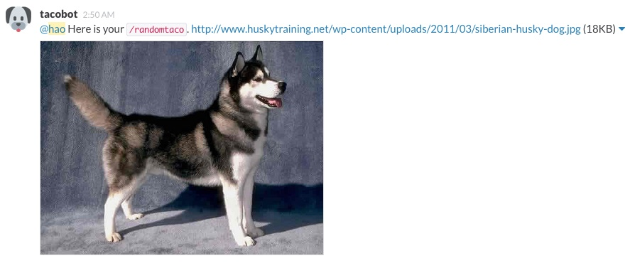

### Features

* You type `/randomtaco`.
* And then you get a random Taco (or his brethren).
* That's it. No Easter Eggs at all.

### Setup

Create an Incoming Hook and note the token. Write the token down in a `token` file.

Create a `start` file with any integer in it.

```
cabal sandbox init
cabal install --only-dependencies -j
cabal run
```

This will launch an HTTP server that listens to port 82.

Create a Custom Command (like `/randomtaco`) and point it at the HTTP server.



### Contributors

* [Hao Lian](https://github.com/hlian)
